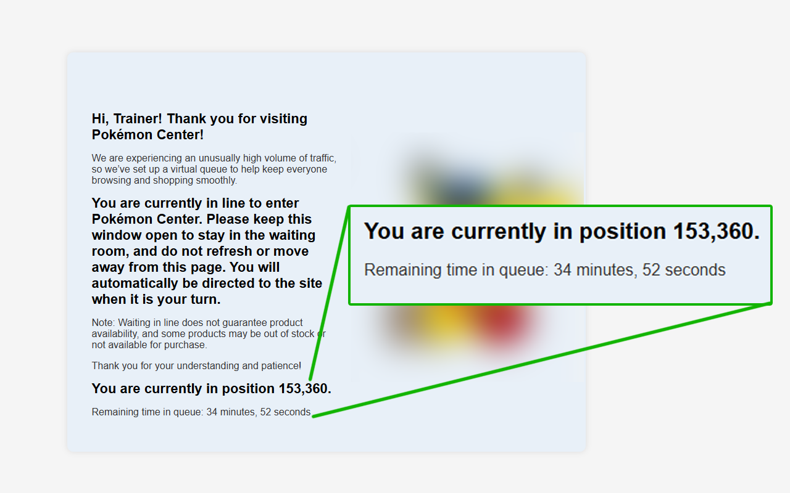

# Pokémon Center Queue Position Viewer

> **This extension has been deprecated.** Queue tracking and more is now available in [CardScout](https://cardscout.co). Thank you to the thousands of trainers who downloaded and used PC Queue. Your support meant everything and helped shape what CardScout has become.

---

## What now?

PC Queue's functionality has been rolled into [CardScout](https://cardscout.co), which offers queue tracking along with deal alerts, price comparisons, and more across Pokémon and other TCGs.

---

## Original Description

This Chrome extension revealed your **current queue position** and **estimated wait time** while waiting in line on [PokemonCenter.com](https://www.pokemoncenter.com).

When high-demand product drops occurred, Pokémon Center placed users in a virtual queue. While the backend tracked your position, the site didn't display it. This extension made that hidden information visible.

---

## 🛠️ How It Works

- **Insert Hidden Element**: When the extension detects that you're in the queue, it adds a hidden `` element to the page. Pokémon Center’s existing code starts updating this span with your position number.
- **Render Display Elements**: The extension also adds two visible UI elements:
  - A message like `You are currently in position 3,402.`
  - An estimate like `Remaining time in queue: 12 minutes, 8 seconds`

- **Track Position Over Time**: It keeps a time-stamped history of your previous positions.
  - When your position updates, it calculates how long it took to move and estimates how long you have left.
  - The estimate improves the longer you stay in queue.

---

## 🚀 Installation

### Option 1: Install from Chrome Web Store _(Recommended)_

> 🔗 [**Click here to install from the Chrome Web Store**](https://chromewebstore.google.com/detail/pc-queue/nlppgblohlmddlmmiedakfcbgoablchp)

This is the easiest way to install and receive updates automatically.

### Option 2: Load Unpacked Extension from GitHub

1. **Download the ZIP** of this repository:  
   [Click here to download](https://github.com/imjoshin/pc-queue/archive/refs/heads/main.zip)

2. **Unzip the file** to a folder on your computer.

3. Open **Chrome**, go to `chrome://extensions/` in your address bar.

4. In the top right, **enable "Developer mode"**.

5. Click **"Load unpacked"**, then select the folder where you unzipped the extension.

6. Done!

---

## ℹ️ Privacy Policy

This extension does not collect, store, or transmit any personal user data.

### Data Collection & Usage

The extension runs entirely in your browser and only interacts with the content of the pokemoncenter.com website. It observes changes to queue-related elements on the page to display your current queue position and estimated wait time. No data is collected, stored, or sent to any server.

### Data Sharing

No user data is shared with any third parties. The extension operates locally and does not communicate with any external services.

If any future updates introduce data collection, users will be notified with a clear in-product disclosure and this policy will be updated accordingly.
